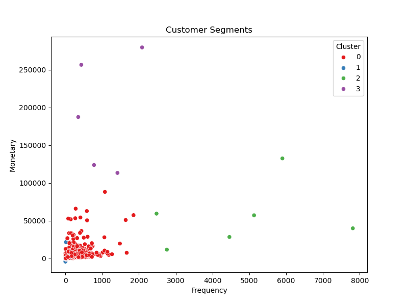
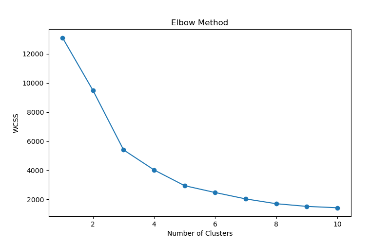

<div align="center">

# 👥 Customer Segmentation Analysis

### Customer Behavior Analysis using Python, Machine Learning, and K-Means Clustering


</div>

---

# 📌 Project Overview

This project applies **K-Means Clustering** to segment customers based on their purchasing behavior. The objective is to identify meaningful customer groups that help businesses design targeted marketing strategies and improve customer retention.

The project covers the complete analytics workflow, including:

- Data Cleaning
- Exploratory Data Analysis (EDA)
- Feature Engineering
- Customer Segmentation
- Cluster Visualization
- Business Insights & Recommendations

---

# 🎯 Business Problem

Businesses often treat all customers the same, leading to ineffective marketing campaigns.

This project aims to answer questions such as:

- Which customers generate the highest revenue?
- Which customer groups require retention strategies?
- How can customers be segmented based on purchasing behavior?
- Which marketing strategy should be applied to each segment?

---

# 📂 Dataset

**Dataset:** Mall Customers Dataset

The dataset contains customer information such as:

- Customer ID
- Gender
- Age
- Annual Income
- Spending Score

The dataset is available inside:

```text
data/raw/
```

---

# 📁 Repository Structure

```text
Customer-Segmentation-Analysis
│
├── data
│   ├── raw
│   │   └── Mall_Customers.xlsx
│   └── processed
│
├── python
│   └── customer_segmentation_analysis.ipynb
│
├── images
│   ├── charts
│   │   ├── customer_segments.png
│   │   └── elbow_method.png
│   └── dashboard
│
├── reports
│   └── business_insights.pdf
│
├── sql
├── excel
├── powerbi
├── docs
│
├── README.md
├── LICENSE
└── .gitignore
```

-----------------------------------------------------------------
# 🛠 Tech Stack

| Category | Technologies |
|-----------|--------------|
| Programming Language | Python |
| Data Processing | Pandas, NumPy |
| Machine Learning | Scikit-Learn (K-Means) |
| Data Visualization | Matplotlib |
| Development Environment | Jupyter Notebook |
| Dataset | Mall Customers Dataset |
| Version Control | Git & GitHub |
----------------------------------------------------------------
---

# ⚙️ Project Workflow

The project follows a complete analytics workflow:

1. Data Collection
2. Data Cleaning
3. Exploratory Data Analysis (EDA)
4. Feature Selection
5. Customer Segmentation using K-Means
6. Elbow Method for Optimal Clusters
7. Cluster Visualization
8. Business Insights
9. Marketing Recommendations

---------------------------------------------------------
# ✨ Key Features

- 📊 Exploratory Data Analysis (EDA)
- 🧹 Data Cleaning & Preprocessing
- 📈 Customer Behavior Analysis
- 🎯 K-Means Clustering
- 📉 Elbow Method
- 📍 Cluster Visualization
- 💡 Business Recommendations
- 📄 Business Insights Report
- # 📊 Project Visualizations

---

# 📊 Project Results

The K-Means algorithm successfully segmented customers into four distinct groups based on purchasing behavior.

### Key Findings

- High-value customers were identified based on spending score.
- Low-engagement customers were grouped for retention campaigns.
- Premium customers showed high purchasing frequency.
- Customer segmentation can significantly improve personalized marketing strategies.

---

## 📈 Visualizations

### Customer Segments

<p align="center">

</p>

---

### Elbow Method

<p align="center">

</p>

---

# 💼 Business Insights

Based on the customer segmentation analysis, several actionable business insights were identified.

## 🎯 Cluster 0 — Regular Customers

- Moderate spending behavior
- Average annual income
- Frequent visitors with consistent purchases

**Recommendation**

- Offer loyalty rewards
- Personalized discount coupons
- Membership programs

---

## 💎 Cluster 1 — High-Value Customers

- High annual income
- High spending score
- Premium customer segment

**Recommendation**

- Exclusive membership benefits
- Early access to new products
- Personalized premium offers

---

## 🛒 Cluster 2 — Budget Customers

- Lower income
- Lower spending score
- Price-sensitive shoppers

**Recommendation**

- Seasonal discounts
- Bundle offers
- Cashback campaigns

---

## ⚠️ Cluster 3 — Potential Customers

- Good income
- Lower spending activity
- Opportunity for conversion

**Recommendation**

- Targeted marketing campaigns
- Product recommendations
- Limited-time promotional offers

---

# 📈 Business Impact

This segmentation enables businesses to:

- Improve customer retention
- Increase marketing effectiveness
- Deliver personalized customer experiences
- Optimize promotional spending
- Increase overall revenue through targeted campaigns

---
---

# 🚀 Getting Started

## Prerequisites

Before running this project, ensure you have:

- Python 3.x
- Jupyter Notebook
- Required Python libraries

Install the required packages using:

```bash
pip install pandas numpy matplotlib scikit-learn
```

---

## Run the Project

1. Clone the repository

```bash
git clone https://github.com/himan6huu/Customer-Segmentation-Analysis.git
```

2. Navigate to the project folder

```bash
cd Customer-Segmentation-Analysis
```

3. Launch Jupyter Notebook

```bash
jupyter notebook
```

4. Open

```text
python/notebooks/customer_segmentation_analysis.ipynb
```

5. Run all notebook cells.

---

# 🧠 Skills Demonstrated

This project demonstrates practical skills in:

- Data Cleaning
- Exploratory Data Analysis (EDA)
- Feature Engineering
- Machine Learning
- Customer Segmentation
- K-Means Clustering
- Elbow Method
- Business Analytics
- Data Visualization
- Business Recommendation Generation

---
---

# 🚀 Future Improvements

This project can be further enhanced by implementing:

- Interactive Power BI dashboard
- Customer Lifetime Value (CLV) analysis
- RFM (Recency, Frequency, Monetary) segmentation
- Additional clustering algorithms (DBSCAN, Hierarchical Clustering)
- Streamlit web application for interactive analysis
- Automated machine learning pipeline
- SQL database integration for real-time customer analysis

---

# 📄 License

This project is licensed under the **MIT License**.

See the [LICENSE](LICENSE) file for more details.

---

# 👨‍💻 Author

<div align="center">

## Himanshu Kumar


**Aspiring Data Analyst | Python | SQL | Power BI | Machine Learning**

📍 Bhubaneswar, Odisha, India

[](https://github.com/himan6huu)

[](https://www.linkedin.com/in/himanshu-kumar-analyst/)

</div>

---

<div align="center">

## ⭐ Support the Project

If you found this project useful or learned something from it, please consider giving it a ⭐ on GitHub.

Your support motivates me to build more real-world Data Analytics and Machine Learning projects.

**Thank you for visiting!**

</div>
